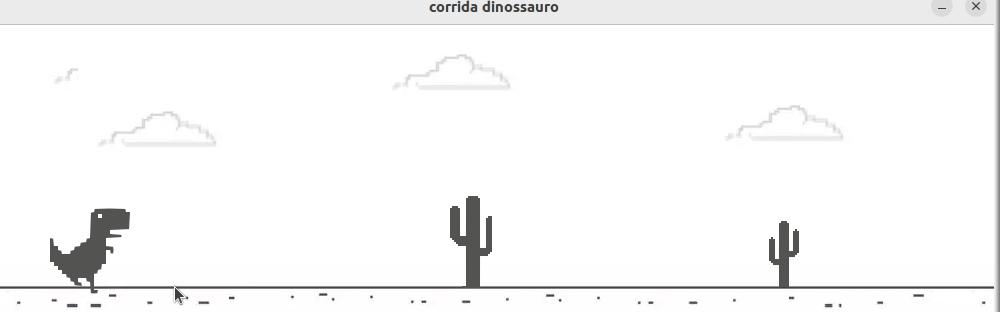

# dinocorrida-ceu

v1: t-rex game 
Uma simples implementação do T-Rex Game, incompleta, onde o dinossauro corre infinitamente por um plano que gera obstáculos de cactos. A colisão não foi implementada.

Para pular qualquer tecla pode ser utilizada, já que o jogo não conta com duelos ou outras ações que faça necessário o uso de qualquer outra tecla.
